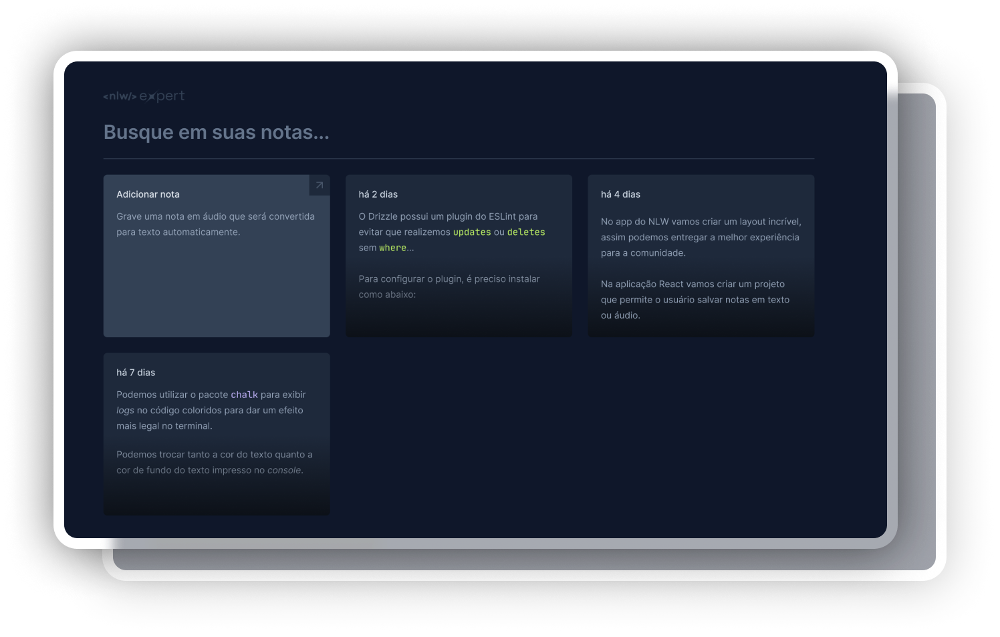

# My Notes

My Notes is an application for creating annotations on a web page.

## Layout

To see the complete layout: [figma](https://www.figma.com/file/4QKEPNENTuir0pS1NoM1XO/NLW-expert-%E2%80%A2-Notes-(Community)?type=design&t=phK4OwdH6h7zfsW6-6)


## Features

- [x] Add notes
- [x] Transciption voice to text
- [x] Detete note

## What was used ?

- [x] Vite
- [x] Tailwind
- [x] React components
- [x] Radix UI
- [x] date-fns
- [x] Sonner
- [x] SpeechRecognition
- [x] Lifting State Up
- [x] LocalStorage

## For Run

With NPM

```bash
npm install
npm run dev
```
